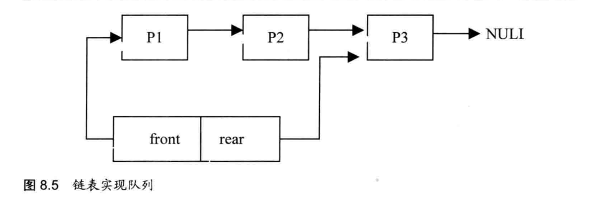

	数据结构主要研究数据的组织方式以及相应的操作方法。它除了描述数据本身之外，还描述数据之间的相互关系。它不仅是一般程序设计的基础，而且是设计编译程序、操作系统、数据库、人工智能及其他大型应用程序的基础。如今，数据结构在计算机科学中占有重要的地位。对于相当多的程序设计来说，认清数据的内在关系，可获得对问题的正确认识，看清问题的结构甚至解法。在一定意义上，程序所描述的就是在数据结构上实现的算法。算法的设计依赖于数据的逻辑结构，算法的实现依赖于数据的存储结构，所以数据结构选择得好坏，对程序质量的影响甚大。掌握基本的数据结构知识，是提高程序设计水平的必要条件。
​	单链表的结构是数据结构中最简单的，它的每一个节点只有一个指向后一个节点的指针，其模型如图8.1所示。


​	循环链表与单链表一样，是一种链式的存储结构;不同的是，循环链表的最后一个节点的指针指向该循环链表的第一个节点或者表头节点，从而构成一个环形的链。其结构模型如图8.2所示。


​	当对单链表进行操作时，有时你要对某个结点的直接前驱进行操作，又必须从表头开始查找。由于单链表每个结点只有一个存储直接后继结点地址的链域，因此运用单链表是无法办到的。那么能不能定义一个既有存储直接后继结点地址的链域，又有存储直接前驱结点地址的链域的这样一个双链域结点结构呢?有，这就是双向链表。
​	在双向链表中，结点除含有数据域外，还有两个指针，一个存储直接后继结点地址，另一个存储直接前驱结点地址。.双向链表如图8.3所示。


# 1. 编程实现一个单链表的建立

```cpp
typedef struct Node
{
    int data;
    Node *next;
}Node;

Node* create()
{
    Node* head = new Node(); // 创建头节点
    head->next = NULL; // 初始化头节点的指针域为NULL

    Node* q = head; // 辅助指针指向头节点
    int x;
    cout << "Please input the data (end with 0):" << endl;
    while (cin >> x && x != 0) {
        Node* p = new Node(); // 创建新节点
        p->data = x;
        p->next = NULL;
        q->next = p; // 将新节点连接到链表尾部
        q = p; // 更新辅助指针指向新的尾节点
    }
    return head; // 返回头节点指针
}
```

​	上面的代码中，使用while循环每次从终端读入一个整型数据，并调用malloc动态分配链表节点内存存储这个整型数据，然后插入到单链表的末尾。最后，当数据为0时表示插入数据结束，此时把末尾节点的next指针置为NULL。

# 2. 编程实现一个单链表的测长

```cpp
int length(Node* head)
{
    int length = 0;
    if(head == NULL)
    {
        return;
    }
    Node* p = head->next;
    while(p != NULL)
    {
        ++length;
        p = p->next;
    }
    return length;
}
```

# 3. 编程实现一个单链表的打印

```cpp
void print(Node* head)
{
    Node* p;
    int index = 0;
    if(head == nullptr || head->next == nullptr)
    {
        cout << "Empty list" << endl;
        return;
    }
    p = head;
    while (p->next != NULL)
    {
        cout << p->data << endl;
        p = p->next;
    }
}
```

# 4. 编程实现一个单链表节点的查找

```cpp
Node* searchNode(Node* head, int pos)
{
    Node* p = head->next;
    if(pos < 0)
    {
        cout << "pos incorrect! " << endl;
        return NULL;
    }
    if(pos == 0)
    {
        return head;
    }
    if(p == NULL)
    {
        cout << "list is NULL" << endl;
        return NULL;
    }

    while(--pos)
    {
        p = p->next;
        if((p) == NULL)
        {
            cout << "incorrect postion to search node!\n";
            break;
        }
    }
    return p;
}
```

# 5.  编程实现一个单链表节点的插人

```cpp
Node* deleteNode(Node* head, int pos)
{
    Node* p = head->next;
    Node* item = NULL;
    if(p == NULL)
    {
        cout << "Empty list" << endl;
        return NULL;
    }
    if(pos <= 0)
    {
        cout << "pos incorrect!" << endl;
        return NULL;
    }

    p = searchNode(head, pos - 1);
    if( p!=NULL && p->next!= NULL)
    {
        item = p->next;
        p->next = item->next;
        delete item;
    }
    return head;
}
```

# 6. 编程实现一个单链表节点的删除

```cpp
Node* deleteNode(Node* head, int pos)
{
    Node* p = head->next;
    Node* item = NULL;
    if(p == NULL)
    {
        cout << "Empty list" << endl;
        return NULL;
    }
    if(pos <= 0)
    {
        cout << "pos incorrect!" << endl;
        return NULL;
    }

    p = searchNode(head, pos - 1);
    if( p!=NULL && p->next!= NULL)
    {
        item = p->next;
        p->next = item->next;
        delete item;
    }
    return head;
}
```

# 7. 实现一个单链表的逆置

```cpp
Node* reverseList(Node* head)
{
    Node* start = head;
    Node* p =head->next;
    Node* pNext;
    Node* pNextNext;
    if(p == NULL)
    {
        cout << "Empty list" << endl;
        return head;
    }
    pNext = p->next;
    p->next = NULL;
    while(pNext != NULL)
    {
        pNextNext = pNext->next;
        pNext->next = p;
        p = pNext;
        pNext = pNextNext;
    }
    head->next = p;
    return head;
}
```

# 8. 寻找单链表的中间元素

```cpp
Node* findMid(Node* head)
{
    Node* current = head->next;
    Node* middle  = head->next;
    if(head->next == NULL)
    {
        return head;
    }
    while(current != NULL && current->next!=NULL)
    {
        current = current->next->next;
        middle  = middle->next;
    }
    return middle;
}
```

# 9. 单链表的正向排序

```cpp
// 插入排序函数
Node* insertionSortList(Node* head) {
    if (!head || !head->next) return head; // 空链表或者只有一个节点，直接返回

    Node dummy = {0, nullptr}; // 创建哑节点作为新链表的头部
    Node* prev = &dummy; // prev指向已排序部分的最后一个节点

    while (head) {
        Node* cur = head; // cur指向当前需要插入的节点
        head = head->next; // head指向下一个待插入的节点

        if (cur->data < prev->data) {
            // 如果当前节点的值小于已排序部分的最后一个节点的值，则从头开始搜索插入位置
            prev = &dummy; // 重置prev为哑节点
        }

        // 在已排序部分中找到合适的位置插入当前节点
        while (prev->next && prev->next->data < cur->data) {
            prev = prev->next;
        }

        cur->next = prev->next; // 插入节点
        prev->next = cur;
    }

    return dummy.next; // 返回排序后的链表头部
}
```


# 10.  判断链表是否存在环型链表问题

```cpp
bool isLoop(Node* head)
{
    Node* p1 = head->next;
    Node* p2 = head->next;

    if(head == NULL || head->next ==NULL)
    {
        return false;
    }

    do
    {
        p2 = p2->next->next;
        p1 = p1->next;
    }while(p2 && p2->next && p1 != p2);
    if(p1 == p2)
    {
        return true;
    }
    else
    {
        return false;
    }
}
```


# 11. 有序单链表的合并


```cpp
Node* merge(Node* head1, Node* head2) {
    if (head1 == nullptr) {
        return head2;
    } else if (head2 == nullptr) {
        return head1;
    }

    Node* head = nullptr; // 合并后的头指针
    Node* tail = nullptr; // 合并后的尾指针
    Node* head1P = head1; // 链表1当前节点
    Node* head2P = head2; // 链表2当前节点

    // 确定合并后的头节点
    if (head1P->data < head2P->data) {
        head = head1P;
        head1P = head1P->next;
    } else {
        head = head2P;
        head2P = head2P->next;
    }
    tail = head;

    // 合并两个链表
    while (head1P != nullptr && head2P != nullptr) {
        if (head1P->data < head2P->data) {
            tail->next = head1P;
            head1P = head1P->next;
        } else {
            tail->next = head2P;
            head2P = head2P->next;
        }
        tail = tail->next;
    }

    // 处理剩余节点
    if (head1P != nullptr) {
        tail->next = head1P;
    } else if (head2P != nullptr) {
        tail->next = head2P;
    }

    return head;
}
```


# 12.  约瑟夫问题的解答

​	编号为1，2，…，N的N个人按顺时针方向围坐一圈，每人持有一个密码（正整数)一开始任选一个正整数作为报数上限值M，从第一个人开始按顺时针方向自1开始按顺序报数，报到M时停止报数。报M的人出列，将他的密码作为新的M值，从他在顺时针方向上的下一个人开始重新从1报数，如此下去，直至所有人全部出列为止。试设计一个程序求出出列顺序。

​	显然当有人退出圆圈后，报数的工作要从下一个人开始继续，而剩下的人仍然是围成一个圆圈的，因此可以使用循环单链表。由于退出圆圈的工作对应着表中结点的删除操作，对于这种删除操作频繁的情况，选用效率较高的链表结构。为了程序指针每一次都指向一个具体的代表一个人的结点而不需要判断，链表不带头结点。所以，对于所有人围成的圆圈所对应的数据结构采用一个不带头节点的循环链表来描述。设头指针为p，并根据具体情况移动。
​	为了记录退出的人的先后顺序，采用一个顺序表进行存储。程序结束后再输出依次退出的人的编号顺序。由于只记录各个节点的data值就可以，所以定义一个整型一维数组。如int quit[n];n为一个根据实际问题定义的一个足够大的整数。


# 21. 编程实现队列的入队、出队、测长、打印

​	队列的实现可使用链表和数组，本题中我们使用单链表来实现队列。因此我们构造一个如图8.5所示结构的队列。
​	根据上面的结构图，我们可以使用下面的结构体定义队列和队列的节点。



```cpp
typedef struct _Node
{
    int data;
    struct _Node *next;
}node;

typedef struct _Queue
{
    node *front;
    node *rear;
}MyQueue;
```


# 22. 队列和栈有什么区别

考点:队列和栈的区别

出现频率:★★★★★

​	队列与栈是两种不同的数据结构。它们有以下区别。
​	(1）操作的名称不同。队列的插入称为入队，队列的删除称为出队。栈的插入称为进栈，栈的删除称为出栈。

​	(2）可操作的方向不同。队列是在队尾入队，队头出队，即两边都可操作。而栈的进栈和出栈都是在栈顶进行的，无法对栈底直接进行操作。
​	(3）操作的方法不同。队列是先进先出（FIFO)，即队列的修改是依先进先出的原则进行的。新来的成员总是加入队尾（不能中间插入)，每次离开的成员总是队列头上的(不允许中途离队)。而栈为后进先出(LIFO)，即每次删除（出栈)的总是当前栈中“最新的”元素，即最后插入（进栈）的元素，而最先插入的被放在栈的底部，要到最后才能删除。


# 23. 简答题--队列和栈的使用
考点:队列和栈的使用

出现频率:★★★★★

一个顺序为1，2，3，4，5，6的栈，依次进入一个队列，然后进栈，顺序是什么?

​	首先一个顺序为1，2，3，4，5，6的栈，其意思是进栈的顺序是1，2，3，4，5，6。按照栈的结构，1由于最先进栈，所以被放入栈底;6最后进栈，因此6位于栈顶。
​	然后进入一个队列。因为只能在栈顶进行出栈操作，也就是说，6最先出栈，1最后出栈。因此，队列的入队顺序（也就是栈的出栈顺序）为6，5，4，3，2，1。
​	最后再进栈。队列是个FIFO（先进先出）的结构，因此出队顺序与入队的顺序相同，即6，5，4，3，2，1。也就是6最先进栈，1最后进栈。因此，此时6位于栈底，1位于栈顶。


# 25. 使用队列实现栈

